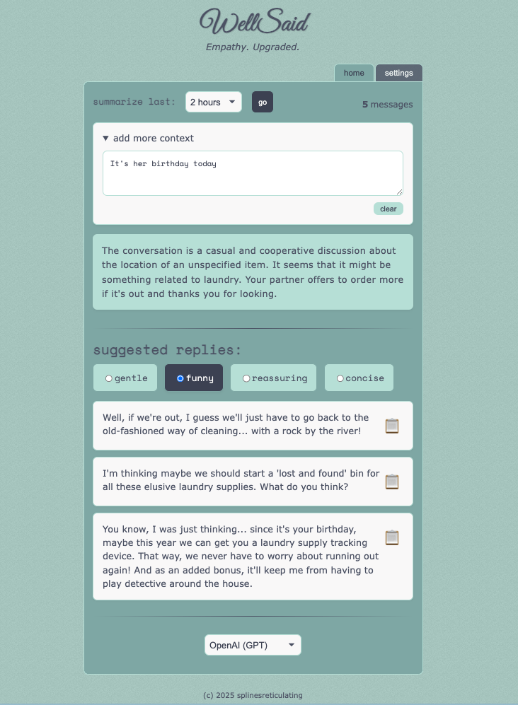
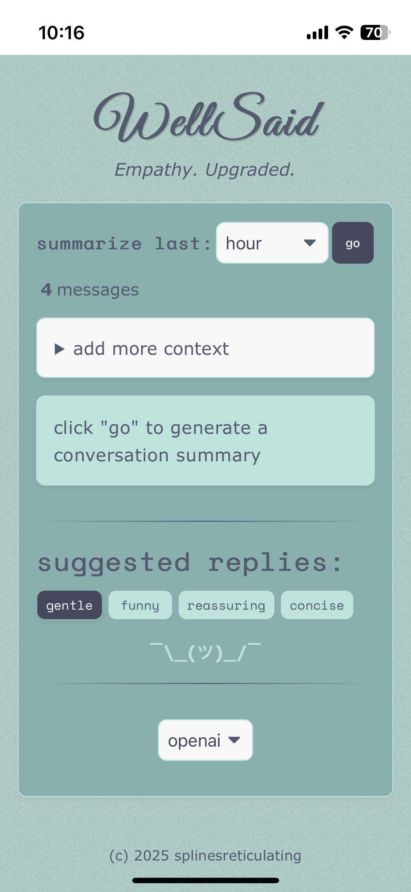

<div align="center">
  
  <h1 align="center">WellSaid</h1>
  <h3 align="center">Empathy. Upgraded.</h3>
  <p align="center">


  </p>

  <p align="center">WellSaid helps you communicate with more empathy and clarity by offering iMessage conversation summaries and tone-based reply suggestions.</p>

  <hr>
</div>

- [Features](#features)
- [Getting Started](#getting-started)
- [Usage](#usage)
- [How It Works](#how-it-works)
- [Technical Details](#technical-details)
- [Development and Local Usage](#development-and-local-usage)
- [Accessing from Anywhere](#accessing-from-anywhere)
- [iOS Home Screen Icons (and HTTPS Gotchas)](#ios-home-screen-icons-and-https-gotchas)
- [Troubleshooting](#troubleshooting)
- [Acknowledgements](#acknowledgements)
- [Box Art](#box-art)
- [Screenshots](#screenshots)
- [Contributing](#contributing)
- [License](#license)

## Features

- **Conversation Summaries**: Analyze and summarize your Apple iMessage conversations with a specified contact from the last 15 minutes to 24 hours
- **Smart Reply Suggestions**: Get short, medium, and long AI-generated reply options based on recent and historical conversation context
- **Translate Mode**: Write your raw, unfiltered draft — WellSaid polishes it into short, medium, and long versions in your chosen tone
- **Tone Selection**: Set the tone for your replies (gentle, funny, reassuring, concise)
- **Context Addition**: Add additional context to help generate more relevant replies
- **Dark Mode & Accent Colors**: Floating theme picker with 5 accent colors and dark/light toggle, persisted across sessions
- **Message Database Integration**: Connects directly to your macOS Messages app database

## Getting Started

### Requirements

- iMessages database access -- designed to run from a Mac logged into your iCloud
- API key from OpenAI, Anthropic, or Grok, or a local [Khoj](https://khoj.dev/) instance

### Installation

1. Clone the repository

```bash
git clone https://github.com/artificial-eq/WellSaid.git
cd WellSaid
```

2. Install dependencies

```bash
yarn install
```

3. Generate SvelteKit types (required for testing)

```bash
yarn prepare
```

4. Configure environment variables

```bash
cp .env.example .env
```

Update the values in the `.env` file. The following variables are needed:

- **Logging**

    - `LOG_LEVEL`: Logging level (info, debug, warn, error)

- **Remote Access**

    - `ALLOWED_HOST`: For remote access via Tailscale (see 'Accessing from Anywhere' below) -- leave blank or set to 'all' if you don't need access from outside your local network

- **Security**
    - `APP_USERNAME`: A name of your choosing
    - `APP_PASSWORD`: A passowrd of your choice
    - `JWT_SECRET`: A big, long, hard, random, and unpredictable string.
      You can generate one using OpenSSL with the following command in your terminal:
    ```bash
    openssl rand -base64 64
    ```
    - Copy the output of this command and use it as the value for `JWT_SECRET` in your `.env` file. Ensure it's on a single line.

5. Start the development server

```bash
yarn dev
```

The server will run over HTTP by default. If you place `cert.pem` and
`key.pem` in a `.certs` directory at the project root (see the HTTPS section
below), it will automatically use those files and start with HTTPS. Pretty cool.

## Usage

1. Select a time frame (15 min – 24 hours) and click **go** to generate a conversation summary and three suggested replies
2. Copy a suggested reply directly, or write your own draft in the text box and click **translate** to have AI polish it into short, medium, and long versions
3. Use the tone pills (gentle, funny, reassuring, concise) to shape the style of generated replies
4. Click the 🎨 button (bottom right) to switch accent colors or toggle dark mode

## How It Works

WellSaid connects to your macOS Messages database to fetch your conversations with a specific contact. It then uses an AI provider (OpenAI, Anthropic, Grok, or Khoj) to analyze the conversation and generate:

1. A summary of the conversation, including emotional tone and key topics
2. Three suggested replies (short, medium, and long) in your chosen tone

In **translate mode**, you write a raw draft and the AI rewrites it in your chosen tone — useful when you know what you want to say but want help saying it well.

## Technical Details

### Minimal Dependencies and Efficient Architecture

WellSaid is built with a focus on minimalism and efficiency:

- **Core Dependencies**: Uses only essential libraries for its functionality
- **Frontend**: Built with SvelteKit, providing excellent performance without the overhead of larger frameworks
- **Backend**: Lightweight Node.js server with minimal dependencies
- **Database**: Direct integration with macOS Messages database - no additional database required
- **Authentication**: Simple JWT-based authentication system

This approach results in a lightweight, fast application that runs efficiently on macOS systems while maintaining all core functionality.

- **Frontend**: Svelte 5 with SvelteKit
- **State Management**: Svelte's built-in `$state` runes
- **Styling**: OKLch semantic color system with dark mode and accent theming (`src/variables.css`)
- **Database**: SQLite (macOS Messages database + `settings.db` for runtime config)
- **AI Integration**: OpenAI (gpt-4o), Anthropic (claude-opus-4-7), Grok (grok-3), and/or local [Khoj](https://khoj.dev/)
- **Logging**: Pino for structured logging

## Development and Local Usage

```bash
# Install dependencies first
yarn install
yarn prepare

# Run in development mode with hot-reloading
yarn dev

# Lint code
yarn lint

# Format code
yarn format

# Build optimized version
yarn build

# Run the optimized build locally
yarn preview

# Run tests
yarn test

# Run tests with watch mode
yarn test:watch

# Run tests with coverage report
yarn test:coverage
```

**Note**: Since this application only runs on macOS and accesses local system resources, there is no traditional "production deployment" - the built version is simply run locally on your Mac. The `yarn build` and `yarn preview` commands create and run an optimized version that may provide better performance than development mode.

## Accessing from Anywhere

If you'd like to securely access WellSaid remotely, use [Tailscale](https://tailscale.com) to set up a secure private network that connects your devices.

Once your Tailscale network is set up, all that's required in the app is that you set the `ALLOWED_HOST` variable in your `.env` file to the address provided by Tailscale. For more details, visit [Tailscale's documentation](https://tailscale.com/kb/).

### iPhone Home Screen Icons (and HTTPS Gotchas)

To make your WellSaid app look great when saved to your iPhone's Home Screen, iOS requires a **valid HTTPS certificate**. This step is optional—if you just want to run the app locally in a browser, you can skip it and use plain HTTP.

1. **Install mkcert (if not already installed)**

```bash
brew install mkcert
mkcert -install
```

2. **Generate a local trusted cert and run your app with HTTPS**

```bash
mkcert <your-tailscale-hostname>.<tailscale-subdomain>.ts.net localhost
```

This will create a cert/key pair like `rootCA.pem` and `rootCA-key.pem`.
Move the generated certificate files into a `.certs` directory at the project
root so the development server can automatically find them.

3. **Trust the cert on your iPhone**

- Convert the root CA to iOS-compatible format:

```bash
openssl x509 -inform PEM -in "$(mkcert -CAROOT)/rootCA.pem" -outform DER -out mkcert-rootCA.cer
```

- AirDrop or email the `mkcert-rootCA.cer` file to your iPhone
- Open it, then go to:
    - **Settings → General → VPN & Device Management → Install Profile**
    - **Settings → General → About → Certificate Trust Settings → Enable full trust** for mkcert root

Now when you visit your app over HTTPS (via Safari), iOS will trust the cert, and your manifest and icon will load properly — giving your app a real custom icon when added to the Home Screen.

## Privacy and Security Considerations

- All conversation analysis happens through the selected AI provider (OpenAI, Anthropic, Grok, or Khoj), so your data is subject to that provider's privacy policy.

## Troubleshooting

### Common Issues

- **0 Messages Found**: Open the Messages app on your Mac and sign in if you haven't already. Summaries and replies will be available once you've signed in and your contact has sent at least one message.
- **Messages Not Loading**: Ensure you've set the correct phone number for your contact in Settings
- **Permission Issues**: WellSaid needs access to your Messages database. Make sure your terminal and/or editor app has Full Disk Access in System Preferences > Security & Privacy.
- **Go Button Disabled**: Conversation summaries are only available when your contact has responded in the selected time frame.

## Acknowledgements

- [Svelte](https://svelte.dev/) - The web framework used
- [OpenAI](https://openai.com/) - AI model provider
- [Anthropic](https://www.anthropic.com/) - Claude model provider
- [Grok](https://x.ai/) - Additional AI provider option
- [Khoj](https://khoj.dev/) - Alternative local AI model provider and search
- [SQLite](https://sqlite.org/) - Database engine
- [Tailscale](https://tailscale.com/) - For making secure remote access easy

## Box Art

<p align="center" style="display: flex; gap: 20px; justify-content: center;">
  
</p>

## Screenshots

<table>
  <tr>
    <td align="center">
      <h4>Desktop</h4>
      
    </td>
    <td align="center">
      <h4>Mobile</h4>
      
    </td>
  </tr>
</table>

## Contributing

Feel free to submit a pull request or open an issue if you find a bug or have a feature you'd like to add.

## License

This project is licensed under the MIT License. [See?](LICENSE)
